# 🔍 Automated GCP Cost Anomaly Report


An intelligent, automated system that monitors Google Cloud Platform (GCP) billing data to detect cost anomalies and send real-time alerts via Slack and GitHub Issues. This solution helps organizations proactively manage cloud costs by identifying unexpected spending patterns before they become expensive problems.

## 📑 Table of Contents

- [Overview](#overview)
- [Architecture](#architecture)
- [Features](#features)
- [How It Works](#how-it-works)
- [Prerequisites](#prerequisites)
- [Setup Guide](#setup-guide)
  - [1. GCP Billing Export Configuration](#1-gcp-billing-export-configuration)
  - [2. Service Account Setup](#2-service-account-setup)
  - [3. GitHub Secrets Configuration](#3-github-secrets-configuration)
  - [4. Workflow Configuration](#4-workflow-configuration)
- [Configuration Parameters](#configuration-parameters)
- [Anomaly Detection Algorithm](#anomaly-detection-algorithm)
- [Notification Channels](#notification-channels)
- [Usage](#usage)
- [Tuning and Optimization](#tuning-and-optimization)
- [Troubleshooting](#troubleshooting)
- [Project Structure](#project-structure)
- [Contributing](#contributing)
- [License](#license)

## 🎯 Overview

The Automated GCP Cost Anomaly Report is a serverless monitoring solution that:

- **Automatically analyzes** daily GCP billing data exported to BigQuery
- **Detects anomalies** by comparing current costs against historical baselines
- **Alerts teams** via Slack webhooks and GitHub Issues when unusual spending is detected
- **Runs daily** via GitHub Actions without requiring dedicated infrastructure
- **Provides actionable insights** with detailed cost breakdowns by GCP service

## 🏗️ Architecture

```mermaid
graph TB
    subgraph "GCP Cloud"
        A[GCP Services] -->|Generate Costs| B[GCP Billing]
        B -->|Export Daily| C[BigQuery<br/>Billing Table]
    end
    
    subgraph "GitHub Actions"
        D[Scheduled Cron<br/>Daily 06:00 UTC] -->|Trigger| E[GitHub Actions Workflow]
        E -->|Authenticate| F[GCP Service Account]
        F -->|Query| C
        E -->|Execute| G[Python Script<br/>detect_cost_anomalies.py]
    end
    
    subgraph "Anomaly Detection Logic"
        G -->|Fetch Data| H[Query Recent Costs<br/>Yesterday]
        G -->|Fetch Data| I[Query Baseline Costs<br/>Past 7 Days]
        H --> J[Compare & Analyze]
        I --> J
        J -->|Calculate| K{Anomaly<br/>Detected?}
    end
    
    subgraph "Notification System"
        K -->|Yes| L[Format Alert Message]
        L --> M[Send to Slack<br/>Webhook]
        L --> N[Create GitHub Issue<br/>with Details]
        K -->|No| O[Log: No Anomalies<br/>End Job]
    end
    
    subgraph "Alert Destinations"
        M --> P[Slack Channel]
        N --> Q[GitHub Repository Issues]
    end
    
    style A fill:#4285F4
    style C fill:#669DF6
    style G fill:#FFA500
    style K fill:#FF6B6B
    style P fill:#611F69
    style Q fill:#24292E
    style J fill:#90EE90
```



### Architecture Flow

1. **Data Collection**: GCP automatically exports billing data to BigQuery daily
2. **Scheduled Execution**: GitHub Actions runs the workflow daily at 06:00 UTC (configurable)
3. **Authentication**: Workflow authenticates to GCP using service account credentials
4. **Data Analysis**: Python script queries BigQuery for recent and baseline costs
5. **Anomaly Detection**: Algorithm compares current costs against historical baseline
6. **Alert Generation**: If anomalies are detected, formatted messages are sent
7. **Notification Delivery**: Alerts are posted to Slack and/or GitHub Issues

## ✨ Features

### 🎯 Core Capabilities

- **Automated Daily Monitoring**: Runs automatically via GitHub Actions without manual intervention
- **Service-Level Analysis**: Breaks down costs by individual GCP services for granular insights
- **Intelligent Baseline Comparison**: Compares yesterday's costs against a configurable baseline period
- **Percentage-Based Anomalies**: Detects when costs exceed historical averages by a specified percentage
- **Absolute Threshold Detection**: Flags new services or zero-baseline scenarios when costs exceed minimum thresholds
- **Multi-Channel Notifications**: Sends alerts to both Slack and GitHub Issues simultaneously

### 🔧 Technical Features

- **Flexible Authentication**: Supports both Service Account JSON keys and Workload Identity Federation
- **Configurable Parameters**: All thresholds and baselines are environment-variable driven
- **Error Handling**: Robust logging and error management for production reliability
- **Zero Infrastructure**: Runs entirely on GitHub Actions—no servers to maintain
- **Cost Efficient**: Free tier GitHub Actions usage for most use cases

## 🔄 How It Works

### Daily Execution Flow

1. **Trigger**: GitHub Actions workflow triggers at scheduled time (default: 06:00 UTC)
2. **Authentication**: Authenticates to GCP using stored service account credentials
3. **Data Query**: 
   - Queries BigQuery for yesterday's costs grouped by service
   - Queries past N days (default: 7) for baseline comparison
4. **Analysis**:
   - Calculates average daily cost for each service over baseline period
   - Compares yesterday's cost to baseline average
   - Identifies services exceeding threshold percentage
   - Flags new services with costs above absolute minimum
5. **Notification**:
   - Formats detailed anomaly report
   - Posts to Slack webhook (if configured)
   - Creates GitHub Issue (if enabled)
6. **Logging**: Records all activities and results for audit trail

## 📋 Prerequisites

Before setting up this project, ensure you have:

### GCP Requirements
- ✅ Active GCP project with billing enabled
- ✅ BigQuery API enabled
- ✅ Billing export to BigQuery configured
- ✅ Service account with BigQuery Data Viewer permissions
- ✅ Service account JSON key (or Workload Identity configured)

### GitHub Requirements
- ✅ GitHub repository (this repo)
- ✅ GitHub Actions enabled
- ✅ Permissions to add repository secrets

### Optional Requirements
- ✅ Slack workspace with webhook URL (for Slack notifications)
- ✅ Basic understanding of YAML, Python, and cloud costs

## 🚀 Setup Guide

### 1. GCP Billing Export Configuration

#### Enable Billing Export to BigQuery

1. Navigate to **GCP Console** → **Billing** → **Billing Export**
2. Click **Edit Settings** for "Detailed usage cost"
3. Select or create a BigQuery dataset
4. Enable export and note the table name format:
   ```
   project-id.dataset-name.gcp_billing_export_v1_XXXXXX_XXXXXX_XXXXXX
   ```
5. Wait 24 hours for initial data population

### 2. Service Account Setup

#### Create Service Account

```bash
# Set variables
export PROJECT_ID="your-project-id"
export SA_NAME="cost-anomaly-detector"

# Create service account
gcloud iam service-accounts create $SA_NAME \
    --description="Service account for cost anomaly detection" \
    --display-name="Cost Anomaly Detector"

# Grant BigQuery Data Viewer role
gcloud projects add-iam-policy-binding $PROJECT_ID \
    --member="serviceAccount:$SA_NAME@$PROJECT_ID.iam.gserviceaccount.com" \
    --role="roles/bigquery.dataViewer"

# Grant BigQuery Job User role (to run queries)
gcloud projects add-iam-policy-binding $PROJECT_ID \
    --member="serviceAccount:$SA_NAME@$PROJECT_ID.iam.gserviceaccount.com" \
    --role="roles/bigquery.jobUser"

# Create and download key
gcloud iam service-accounts keys create key.json \
    --iam-account=$SA_NAME@$PROJECT_ID.iam.gserviceaccount.com
```

#### Alternative: Workload Identity Federation (Recommended)

For enhanced security, configure Workload Identity Federation instead of using service account keys. See [GCP Workload Identity Documentation](https://cloud.google.com/iam/docs/workload-identity-federation).

### 3. GitHub Secrets Configuration

Add the following secrets to your GitHub repository:

#### Navigate to Repository Settings
`Settings` → `Secrets and variables` → `Actions` → `New repository secret`

#### Required Secrets

| Secret Name | Description | Example |
|------------|-------------|---------|
| `GCP_SERVICE_ACCOUNT_KEY` | Entire contents of `key.json` file | `{ "type": "service_account", ... }` |

#### Optional Secrets

| Secret Name | Description | Required For |
|------------|-------------|--------------|
| `SLACK_WEBHOOK_URL` | Slack incoming webhook URL | Slack notifications |

**Note**: `GITHUB_TOKEN` is automatically provided by GitHub Actions.

### 4. Workflow Configuration

Edit [.github/workflows/detect-cost-anomalies.yml](.github/workflows/detect-cost-anomalies.yml):

```yaml
- name: Run anomaly detection
  env:
    BILLING_TABLE: "your-project.your_dataset.gcp_billing_export_v1_XXXXXX_XXXXXX_XXXXXX"  # UPDATE THIS
    THRESHOLD_PERCENT: "30"
    BASELINE_DAYS: "7"
    MIN_ABSOLUTE_INCREASE: "5.0"
    # ... other settings
```

**Important**: Update `BILLING_TABLE` with your actual BigQuery billing table name.

## ⚙️ Configuration Parameters

All configuration is managed via environment variables in the workflow file:

| Parameter | Default | Description |
|-----------|---------|-------------|
| `BILLING_TABLE` | **Required** | Full BigQuery table path: `project.dataset.table` |
| `THRESHOLD_PERCENT` | `30` | Percentage increase to trigger anomaly (e.g., 30 = 30%) |
| `BASELINE_DAYS` | `7` | Number of days to use for baseline average calculation |
| `MIN_ABSOLUTE_INCREASE` | `5.0` | Minimum dollar amount to trigger anomaly for new services (USD) |
| `SLACK_WEBHOOK_URL` | Optional | Slack webhook URL for notifications |
| `CREATE_GITHUB_ISSUE` | `false` | Set to `"true"` to create GitHub issues for anomalies |
| `GITHUB_TOKEN` | Auto | Automatically provided by GitHub Actions |
| `GITHUB_REPOSITORY` | Auto | Automatically set to `owner/repo` format |

## 🧮 Anomaly Detection Algorithm

The system uses a two-pronged approach to detect cost anomalies:

### 1. Percentage-Based Detection (Established Services)

For services with historical baseline data:

```
Baseline Average = Total Cost (Past N Days) / N Days
Percentage Change = ((Yesterday's Cost - Baseline Average) / Baseline Average) × 100

IF Percentage Change > THRESHOLD_PERCENT:
    → Anomaly Detected
```

**Example**:
- Baseline average: $100/day over 7 days
- Yesterday's cost: $150
- Percentage change: 50%
- Threshold: 30%
- **Result**: ✅ Anomaly (50% > 30%)

### 2. Absolute Threshold Detection (New Services)

For new services with zero or minimal baseline:

```
IF Baseline Average ≤ 0 AND Yesterday's Cost ≥ MIN_ABSOLUTE_INCREASE:
    → Anomaly Detected
```

**Example**:
- New service with no historical usage
- Yesterday's cost: $25
- Minimum threshold: $5
- **Result**: ✅ Anomaly (new service with significant cost)

### Query Logic

The script executes two BigQuery queries:

#### Baseline Query
```sql
SELECT service.description AS service, SUM(cost) AS baseline_total
FROM `project.dataset.billing_table`
WHERE DATE(usage_start_time) >= DATE('start_date')
  AND DATE(usage_start_time) < DATE('yesterday')
GROUP BY service
```

#### Recent Query
```sql
SELECT service.description AS service, SUM(cost) AS recent_cost
FROM `project.dataset.billing_table`
WHERE DATE(usage_start_time) = DATE('yesterday')
GROUP BY service
```

## 📢 Notification Channels

### Slack Notifications

When anomalies are detected, Slack receives a formatted message:

```
*GCP Cost Anomalies for 2024-12-20* — 3 found

*Service:* Compute Engine
  - Recent: $250.00
  - Baseline avg/day: $150.00
  - Change: 66.7%
  - Note: >30%

*Service:* Cloud Storage
  - Recent: $75.00
  - Baseline avg/day: $50.00
  - Change: 50.0%
  - Note: >30%

*Service:* Cloud Run
  - Recent: $30.00
  - Baseline avg/day: $0.00
  - Change: N/A
  - Note: no baseline; recent >= $5.00
```

### GitHub Issues

When `CREATE_GITHUB_ISSUE: "true"`, the system creates an issue:

**Title**: `[Cost Anomaly] 3 anomaly(s) on 2024-12-20`

**Body**: Same formatted message as Slack + "Detected by automated job."

**Labels**: Can be configured (requires additional workflow customization)

## 📖 Usage

### Manual Trigger

Run the workflow manually for testing:

1. Go to **Actions** tab in your repository
2. Select "Automated GCP Cost Anomaly Report" workflow
3. Click **Run workflow** → **Run workflow**
4. Monitor execution in real-time

### Scheduled Execution

The workflow runs automatically daily at 06:00 UTC. To change the schedule:

```yaml
on:
  schedule:
    - cron: "0 14 * * *"   # 14:00 UTC (2:00 PM UTC)
```

Use [crontab.guru](https://crontab.guru/) to generate cron expressions.

### Local Testing

Test the script locally before deploying:

```bash
# Set up environment
export BILLING_TABLE="your-project.dataset.table"
export THRESHOLD_PERCENT="30"
export BASELINE_DAYS="7"
export MIN_ABSOLUTE_INCREASE="5.0"
export GOOGLE_APPLICATION_CREDENTIALS="path/to/key.json"

# Optional
export SLACK_WEBHOOK_URL="https://hooks.slack.com/services/YOUR/WEBHOOK/URL"
export CREATE_GITHUB_ISSUE="false"

# Install dependencies
pip install -r requirements.txt

# Run script
python src/detect_cost_anomalies.py
```

## 🎛️ Tuning and Optimization

### Adjusting Sensitivity

**Too many false positives?** Increase thresholds:
```yaml
THRESHOLD_PERCENT: "50"          # Increase from 30% to 50%
MIN_ABSOLUTE_INCREASE: "10.0"    # Increase from $5 to $10
```

**Missing real anomalies?** Decrease thresholds:
```yaml
THRESHOLD_PERCENT: "20"          # Decrease to 20%
MIN_ABSOLUTE_INCREASE: "2.0"     # Decrease to $2
BASELINE_DAYS: "14"              # Increase baseline to 14 days for smoother average
```

### Environment-Specific Settings

**Development/Test Environment** (lower costs, higher volatility):
```yaml
THRESHOLD_PERCENT: "100"         # 100% increase required
MIN_ABSOLUTE_INCREASE: "1.0"     # Flag anything over $1
BASELINE_DAYS: "3"               # Shorter baseline due to frequent changes
```

**Production Environment** (higher costs, more stable):
```yaml
THRESHOLD_PERCENT: "20"          # Sensitive to 20% increases
MIN_ABSOLUTE_INCREASE: "50.0"    # Only flag significant new costs
BASELINE_DAYS: "14"              # Longer baseline for stability
```

### Seasonal Adjustments

For businesses with seasonal patterns:
- Increase `BASELINE_DAYS` to 14-30 days to smooth out weekly patterns
- Consider implementing custom baseline logic (requires code modification)
- Use different thresholds during peak vs. off-peak seasons

## 🔧 Troubleshooting

### Common Issues

#### Issue: "BILLING_TABLE environment variable is required"
**Solution**: Ensure `BILLING_TABLE` is set in workflow file:
```yaml
env:
  BILLING_TABLE: "project.dataset.table"
```

#### Issue: "Permission denied" or "Access Denied"
**Solution**: Verify service account has required roles:
- `roles/bigquery.dataViewer`
- `roles/bigquery.jobUser`

#### Issue: "Table not found"
**Solution**: 
1. Verify billing export is enabled and data is populated (wait 24 hours after enabling)
2. Check table name format in BigQuery console
3. Ensure correct project/dataset/table in `BILLING_TABLE`

#### Issue: "No anomalies detected" (but you expect some)
**Solution**:
1. Check if billing data is available for yesterday
2. Lower `THRESHOLD_PERCENT` temporarily to verify detection logic
3. Review logs in GitHub Actions for query results
4. Manually query BigQuery to verify data exists

#### Issue: Slack notifications not working
**Solution**:
1. Verify `SLACK_WEBHOOK_URL` secret is correctly set
2. Test webhook URL manually:
   ```bash
   curl -X POST -H 'Content-type: application/json' \
     --data '{"text":"Test message"}' \
     YOUR_WEBHOOK_URL
   ```
3. Check workflow logs for error messages

#### Issue: GitHub Issues not being created
**Solution**:
1. Ensure `CREATE_GITHUB_ISSUE: "true"` in workflow
2. Verify workflow has `issues: write` permission
3. Check if repository allows issue creation

### Debug Mode

Enable detailed logging by modifying [src/detect_cost_anomalies.py](src/detect_cost_anomalies.py):

```python
logging.basicConfig(level=logging.DEBUG, format="%(asctime)s %(levelname)s %(message)s")
```

### Viewing Logs

1. Go to **Actions** tab
2. Click on latest workflow run
3. Click on **detect-cost-anomalies** job
4. Expand **Run anomaly detection** step
5. Review output for errors or unexpected behavior

## 📁 Project Structure

```
Automated-GCP-Cost-Anomaly-Report/
├── .github/
│   └── workflows/
│       └── detect-cost-anomalies.yml    # GitHub Actions workflow definition
├── src/
│   └── detect_cost_anomalies.py         # Main Python script for anomaly detection
├── requirements.txt                      # Python dependencies
└── README.md                            # This file
```

### File Descriptions

- **`.github/workflows/detect-cost-anomalies.yml`**: Defines the GitHub Actions workflow, including schedule, authentication, and environment variables
- **`src/detect_cost_anomalies.py`**: Core Python script containing:
  - BigQuery query logic
  - Anomaly detection algorithm
  - Slack notification handler
  - GitHub issue creation handler
  - Configuration management
- **`requirements.txt`**: Python package dependencies:
  - `google-cloud-bigquery`: GCP BigQuery client library
  - `requests`: HTTP library for webhooks
  - `pandas`: Data manipulation (if needed)
  - `numpy`: Numerical operations (if needed)

## 🤝 Contributing

Contributions are welcome! Here's how you can help:

### Reporting Issues

1. Check existing issues to avoid duplicates
2. Provide detailed description with:
   - Environment details (GCP project setup, GitHub Actions logs)
   - Steps to reproduce
   - Expected vs. actual behavior
   - Error messages or logs

### Submitting Pull Requests

1. Fork the repository
2. Create a feature branch: `git checkout -b feature/amazing-feature`
3. Make your changes with clear commit messages
4. Test thoroughly (local execution + GitHub Actions)
5. Update documentation if needed
6. Submit pull request with detailed description

### Ideas for Contributions

- 🎨 Enhanced visualization of cost trends
- 📊 Integration with additional notification channels (Teams, PagerDuty, etc.)
- 🧠 Machine learning-based anomaly detection
- 📈 Historical trend analysis and reporting
- 🔄 Support for multi-project billing aggregation
- 🌍 Multi-cloud support (AWS, Azure)
- 🎯 Cost optimization recommendations

## 📄 License

This project is open source and available under the [MIT License](LICENSE).

## 🙏 Acknowledgments

- Built with ❤️ for FinOps and cloud cost optimization
- Powered by Google Cloud Platform, GitHub Actions, and Python
- Inspired by the need for proactive cloud cost management

## 📞 Support

For questions, issues, or feature requests:
- 📝 Open an issue in this repository
- 💬 Join discussions in the Issues tab
- 📧 Contact the maintainers

---

**Happy Cost Monitoring! 💰📊**
